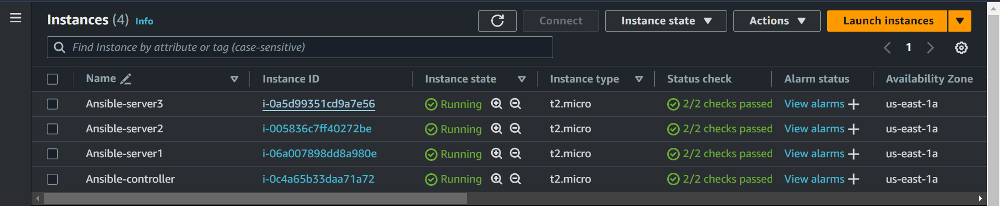
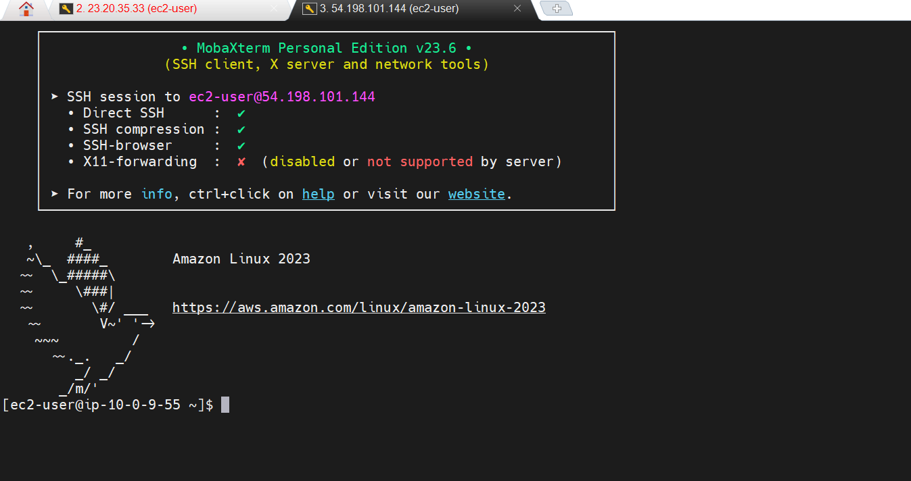

# Deploy a Website 🌐using Ansible Playbook
Create 4EC2 instances. Out of 4, One will be the `Ansible Controller` and the other 3 are `child nodes`. Make sure all the four instances are created with the same key pair.



## Install Ansible in host server(Ansible CONTROLLER) ONLY

1. Connect to your EC2 instance using SSH. 


  
2. Add ansible repository to your instance
```
sudo apt-add-repository ppa:ansible/ansible

```
3. Update the package 
```
sudo apt update

```
4. Install the Ansible 
```
sudo apt install ansible

```

### `In steps 2`  `ADD JENKINS TO DEBIAN REPO`
1. We do this by using the Long term support release 
```
sudo wget -O /usr/share/keyrings/jenkins-keyring.asc \
  https://pkg.jenkins.io/debian-stable/jenkins.io-2023.key

```
2. 
```
echo deb [signed-by=/usr/share/keyrings/jenkins-keyring.asc] \
  https://pkg.jenkins.io/debian-stable binary/ | sudo tee \
  /etc/apt/sources.list.d/jenkins.list > /dev/null

```

### `In steps 3` `INSTALL JENKINS`
1. We first update the libriaries 
```
sudo apt-get update

```
2. install jenkins  
```
sudo apt-get install jenkins -y

```
3. This command will check if jenkins has been install and working `DON'T FORGET TO COPY AND SAVE THE ADMIN PASSWORD` It may also be found  `/var/lib/jenkins/secrets/initialAdminPassword`
```
sudo systemctl status jenkins

```
4. start jenkins `enable` allow you to state the service automatically when the system bot up or when you bot up the system 
```
sudo systemctl enable jenkins

```

### `In steps 3` `ENABLE PORT 8080 ON HOST FIREWALL`
1. We first update the libriaries. `ufw` this is a virtual firewall on ubuntu instance 
```
sudo ufw enable -y

```
2. Then we allow port `8080`. This will allowed all incomming requese coming from this port. We do this because by default http run on port 80 while jenkins on port 8080. So we must always indicate the port of jenkins if not it will not work   
```
sudo ufw allow 8080

```
3. Then we may also need to open SSH   
```
sudo ufw allow openSSH

```

## Author
FOKOUE THOMAS 