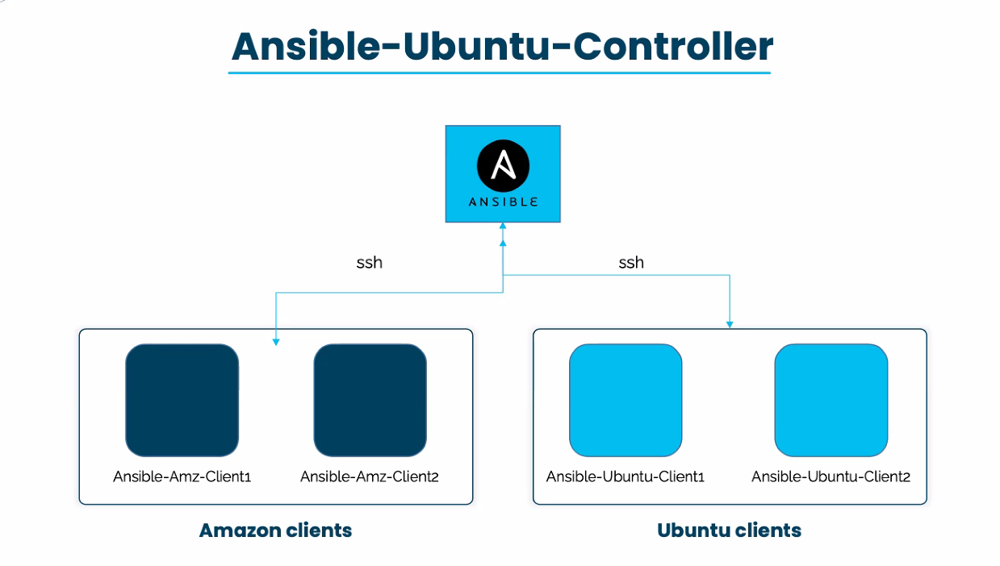

# ANSIBLE-Project-on-AWS
This repo contain all ansible playbook project for AWS

# Ansible Playbook Project1
Setup an Ansible cluster with the controller running on Amazon Linux 2 and the 4 nodes in which 2 running on Amazon linux and 2 running on ubuntu.

Write a playbook with four (4) plays:
Play1: Deploy apache on ubuntu clients
Play2: Deploy apache on amazon clients
Play3: Deploy git on amazon linux clients
Play4: Deploy git on ubuntu clients

# STEPS BY STEPS PROCESS 
Launched 3 amazon linux 2 and 2 ubuntu server:

Installed ansible on linux-ansible-controller:

Verified ansible is installed in linux-ansible-controller. And generated ssh key-pair. Copied the public key to all 4 nodes:

Updated “hosts” file in ansible-controller.

Test the connectivity in-between the controller and nodes:

Run ansible-hw-playbook.yml file

Connect to linux-node1 i.e. “ansible-linux-node1” and verify that index.html file is written in /var/www/html

Connect to ubuntu-node1 i.e. “ansible-node1” and verify that index.html file is written in /var/www/html

Verify GIT is installed in both linux and ubuntu nodes:

