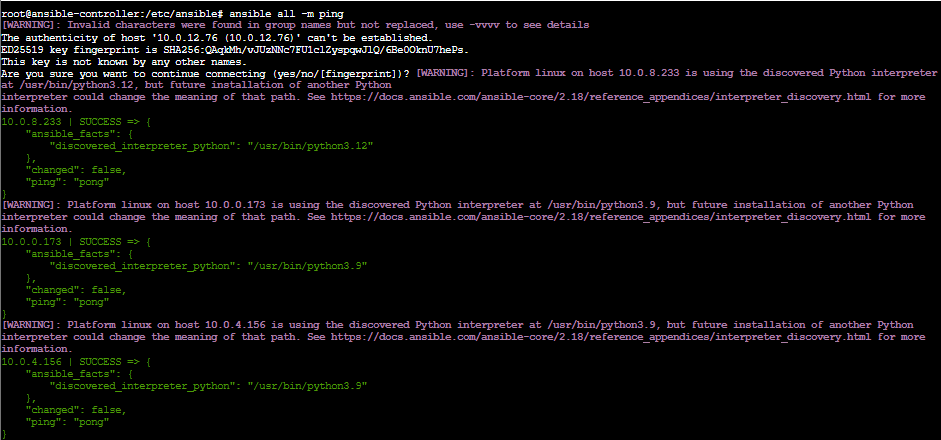
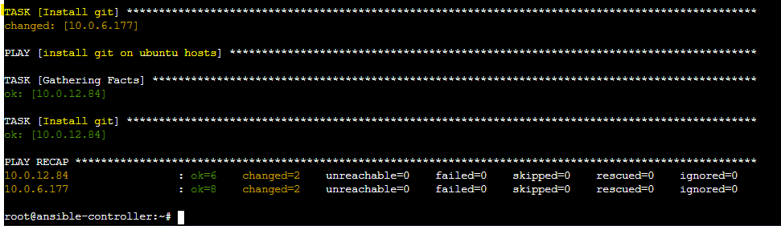

# ANSIBLE-Project-on-AWS
This project demonstrates how to set up and manage a hybrid Ansible cluster with an Ubuntu-based controller managing four clients — two running Amazon Linux and two running Ubuntu.
The setup showcases infrastructure automation, configuration management, and software provisioning across multiple operating systems using Ansible.

# Ansible Playbook Project1
## Setup an Ansible cluster with the controller running on Amazon Linux 2 and the 4 nodes in which 2 running on Amazon linux and 2 running on ubuntu.


🚀 Key Features

- Cross-platform configuration management with Ansible
- Automated SSH setup for secure node communication
- Centralized orchestration of updates and deployments
- Execution of playbooks for package installation, service configuration, and testing

🛠️ Technologies Used

- Ansible (Automation Engine)
- Amazon Linux 2
- Ubuntu 20.04 / 22.04
- SSH for remote communication
- YAML for playbook definitions

### Write a playbook with four (4) plays:
* Play1: Deploy apache on ubuntu clients
* Play2: Deploy apache on amazon clients
* Play3: Deploy git on amazon linux clients
* Play4: Deploy git on ubuntu clients

# STEPS BY STEPS PROCESS 

### 1. Launched 3 amazon linux and 2 ubuntu server:


### 2. Installed ansible on linux-ansible-controller:
- Take up you privilage. the first command for ubuntu and the second for linux. 
```
sudo su - ubuntu
```
```
sudo su - ec2-user
```
- let rename our ubuntu server to "ansible-controller"
```
sudo hostname ansible-controller
```
- For the command to take effect you need to exit(with the command bellow) and login again(with the fist command above)
```
exit
```
- let verifie if python3 and ansible is install 
```
 python3 --version
```
```
 ansible --version
```
- After the verification we notice ansible is not install. So we need to go to the officail documentation [this page](https://docs.ansible.com/ansible/latest/installation_guide/installation_distros.html) depending on our OS we follow the steps and install. For us is Installing Ansible on Ubuntu 
```
sudo apt update
sudo apt install software-properties-common
sudo add-apt-repository --yes --update ppa:ansible/ansible
sudo apt install ansible
```


### 3. Establish SSH connection between Ansible master(controller) and clients(nodes)
#### To do this we need to first generate ssh key pair "id_rsa.pub public key"

- First is to connect as a sudo (the root user) with the command below 
```
 sudo -i
```
- Then we generate our key as a root user
```
 ssh-keygen -t rsa
```
- Let go to the location where the keys have been created
```
 cd .ssh
```
```
 ls -l
```

- Now, let cat into the pub key and copie. This pub key will be use for our nodes
```
 cat id_rsa.pub
```


### 4. We need to copied the public key generate in our ansible-contoller and paste it to all 4 nodes: ubuntu and linux. We can also use "ssh copy id" to automatically copy the key into all the nodes 

- Steps for ubuntu. We follow all the steps above but we don't generate any keys. we just need to cat into the authorised_key and paste the pub_key generated by the controller

```
 cat authorized_keys
```
```
 vi authorized_keys
```
#### When you run the vi command above first thing to do is to press the "i" for insert. After deleting and pasting the pub-key you press the botton "Esc" ":wq!"


- Let look for the private ip address of the node. If ifconfig is not install use the command below it
```
 ifconfig
```
```
 apt install net-tools
```
##### But we can also copy all the Private address of our nodes directly on Aws console. 

- Steps for linux. Same here


### 5. Test the connectivity in-between the controller and nodes:
```
 ssh root@private-ip-address
```


### 6. Adding clients to Ansible AWS Inventory. Here Let updated our Inventory file “hosts” file in ansible-controller.
#### We did a mistake in the naming of our hosts file. Always use small letter and have a "-" in between. so we use "ubuntu" and "linux"
- First thing to do is to cd into etc/ansible
```
 cd /etc/ansible/
```
```
 ls -l
```
```
 cat hosts
```
```
 vi hosts
```
#### When you run the vi command above go to [webserves] modified and group your Private Ips base on thier package manager i.e ubuntu and linux


### 7. Now let us another testing for connectivity in-between the controller and nodes: Ansible Ad-Hoc commands.
```
 ansible Ip-address -m ping
```


- We can also use the command all to ping all the nodes present in our controller. 
```
 ansible all -m ping
```



- We can as well ping base on the tag giving to our inventory file "ubuntu" and "linux". 


### 8. Run ansible-playbook-project1.yml file
- First thing to do is to create this path "/root/web/index.html" for our index.html file on the controller, so we must have that file before running your playbook
```
 sudo mkdir -p /root/web
 echo "<h1>Hello from Ansible</h1>" | sudo tee /root/web/index.html

```
- The playbook need to be run in the controller as a root user 
```
 vi ansible-playbook-project1.yml
```

#### Don't forget to update the host name with name present in your inventory file. 
- Then you run the command below to for ansible to run your playbook 
```
 ansible-playbook ansible-playbook-project1.yml
```




### 9. Connect to linux-node1 i.e. “ansible-linux-node1” and verify that index.html file is written in /var/www/html
```
 ls /var/www/html/
```
```
 cat /var/www/html/index.html
```


### 10. Connect to ubuntu nodes i.e. “ubuntu-node” and verify that index.html file is written in /var/www/html


### 11. Verify GIT is installed in both linux and ubuntu nodes:
```
 git --version
```


### 12. Use your "Public IPv4 address" to see the content of your html file 


## Author
FOKOUE THOMAS


